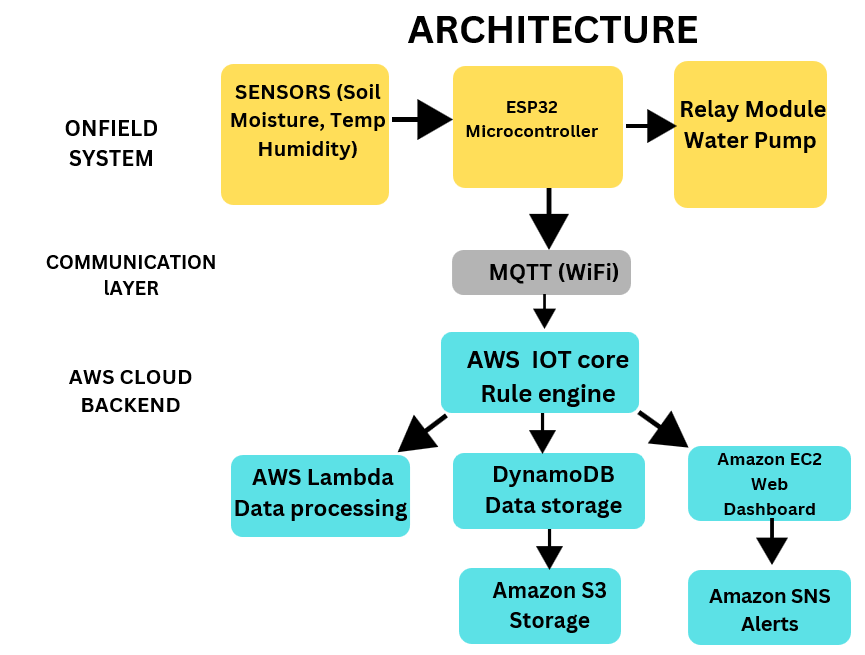
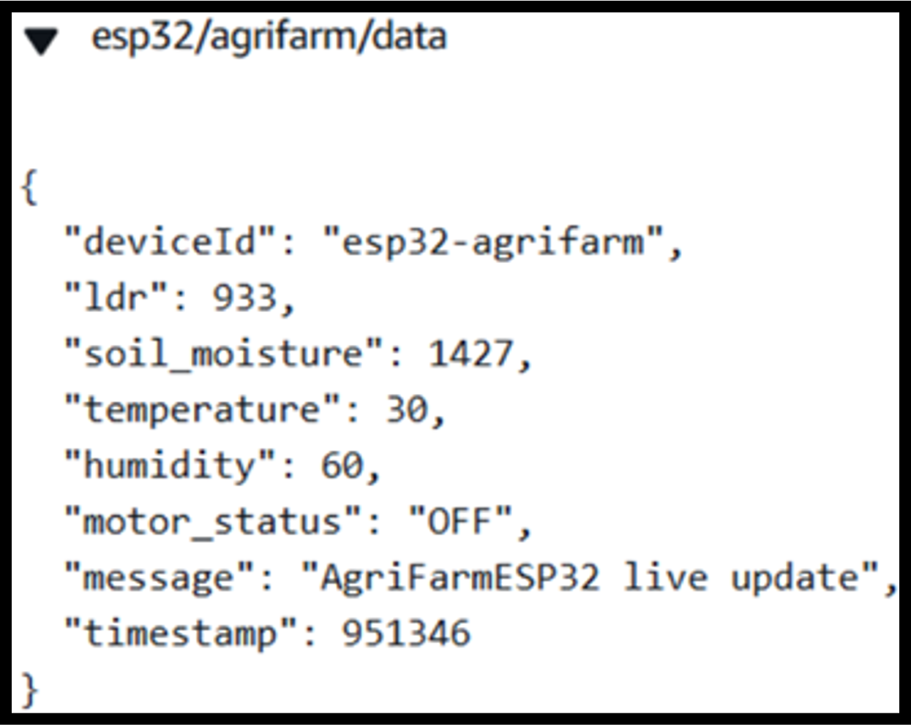
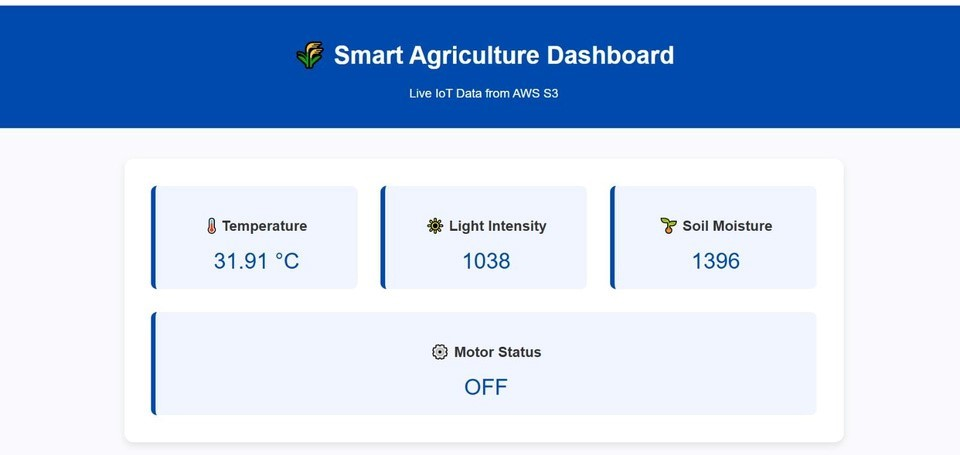

# 🌱 Edge–Cloud Smart Agriculture Infrastructure

A cloud-native IoT solution that integrates **ESP32**, **AWS IoT Core**, **AWS Lambda**, **Amazon EC2**, **Amazon DynamoDB**, **Amazon S3**, and **MQTT** to enable real-time environmental monitoring and intelligent irrigation. The system combines edge computing with cloud processing to provide a scalable, secure, and reliable smart agriculture platform.

---

# 📖 Overview

The **Edge–Cloud Smart Agriculture Infrastructure** is designed to automate agricultural monitoring and irrigation using IoT and AWS cloud technologies.

The system collects environmental parameters such as **soil moisture**, **temperature**, **humidity**, and **light intensity** using ESP32-connected sensors. Sensor data is securely transmitted using the MQTT protocol to **AWS IoT Core**, where it is processed by **AWS Lambda**. The processed data is stored in **Amazon DynamoDB** for real-time monitoring and **Amazon S3** for long-term storage.

A **Flask-based web dashboard** hosted on **Amazon EC2** allows users to monitor live sensor readings remotely, while **Amazon SNS** sends instant alerts whenever abnormal environmental conditions are detected.

To improve reliability, the ESP32 performs local irrigation control by activating the relay whenever soil moisture falls below a predefined threshold, ensuring uninterrupted irrigation even during temporary network outages.

---

# ✨ Features

* Real-time soil moisture monitoring
* Temperature and humidity monitoring
* Ambient light monitoring
* Automatic irrigation using relay-controlled water pump
* Hybrid Edge–Cloud architecture
* MQTT-based communication
* AWS IoT Core integration
* AWS Lambda serverless processing
* Amazon DynamoDB real-time storage
* Amazon S3 long-term storage
* Flask dashboard hosted on Amazon EC2
* Amazon SNS email notifications
* Dockerized deployment
* Continuous operation during internet outages

---

# 🏗️ System Architecture



---

# 🔄 Project Workflow

1. ESP32 collects soil moisture, temperature, humidity, and light intensity data.
2. Sensor data is transmitted securely using MQTT over Wi-Fi.
3. AWS IoT Core receives the telemetry.
4. AWS Lambda processes incoming sensor data.
5. Processed data is stored in Amazon DynamoDB.
6. Historical data and supporting files are stored in Amazon S3.
7. The Flask application hosted on Amazon EC2 retrieves sensor data and displays it on a live dashboard.
8. Amazon SNS sends email notifications whenever abnormal environmental conditions are detected.
9. During network interruptions, the ESP32 autonomously controls irrigation using the relay module.

---

# ☁️ AWS Services Used

| AWS Service     | Purpose                       |
| --------------- | ----------------------------- |
| AWS IoT Core    | MQTT communication with ESP32 |
| AWS Lambda      | Sensor data processing        |
| Amazon DynamoDB | Real-time sensor data storage |
| Amazon S3       | Long-term data storage        |
| Amazon EC2      | Hosting Flask web dashboard   |
| Amazon SNS      | Email notifications           |
| AWS IAM         | Secure cloud resource access  |

---

# 🛠️ Technology Stack

### Cloud

* AWS IoT Core
* Amazon EC2
* AWS Lambda
* Amazon DynamoDB
* Amazon S3
* Amazon SNS
* AWS IAM

### IoT & Hardware

* ESP32
* MQTT
* DHT11 Temperature & Humidity Sensor
* Soil Moisture Sensor
* LDR Sensor
* Relay Module
* Water Pump

### Backend

* Python
* Flask

### DevOps

* Docker
* Git
* Linux

---

# 🔌 Hardware Components

* ESP32 Development Board
* DHT11 Sensor
* Soil Moisture Sensor
* LDR Sensor
* Relay Module
* Water Pump
* Breadboard
* Jumper Wires
* Wi-Fi Connection

---

# 📂 Repository Structure

```text
Smart-Agriculture/
│
├── ARCHITECTURE.png
├── Dockerfile
├── MQTT-TRANSFER
├── MQTT-TRANSFER.png
├── README.md
├── TRANSFER OF DATA THROUGH MQTT.jpg
├── app.py
├── dashboard.jpg
├── index.html
├── microesp
├── s3 live data.PNG
├── serial monitoring.jpg
├── smart-lambda.py
└── sns output.jpg
```

---

# 📸 Project Screenshots

## System Architecture


---

## MQTT Communication



---

## MQTT Data Transfer


---

## Web Dashboard



---

## Amazon S3 Storage


---

## ESP32 Serial Monitor


---

## Amazon SNS Notification


---

# 📄 Source Files

| File                | Description                                                                  |
| ------------------- | ---------------------------------------------------------------------------- |
| **app.py**          | Flask application that provides the web dashboard hosted on Amazon EC2.      |
| **smart-lambda.py** | AWS Lambda function that processes MQTT messages and stores sensor data.     |
| **index.html**      | User interface for the monitoring dashboard.                                 |
| **microesp**        | ESP32 program responsible for sensor data collection and MQTT communication. |
| **Dockerfile**      | Docker configuration used to containerize the Flask application.             |
| **MQTT-TRANSFER**   | MQTT communication configuration and reference file.                         |

---

# 🚀 Future Enhancements

* AI-based irrigation prediction
* Weather API integration
* Mobile application
* Multi-farm monitoring
* OTA firmware updates
* AWS CloudWatch monitoring
* Historical analytics dashboard

---

# 📚 Skills Demonstrated

* Internet of Things (IoT)
* Edge Computing
* Cloud Computing
* AWS IoT Core
* AWS Lambda
* Amazon EC2
* Amazon DynamoDB
* Amazon S3
* Amazon SNS
* MQTT
* Flask
* Docker
* Python
* ESP32
* Embedded Systems
* Cloud-Native Application Development

---

# 👨‍💻 Author

*Vishal M

**Cloud & IoT Engineer**

B.Tech – Electronics & Communication Engineering

**Skills:** AWS • IoT • Cloud Computing • DevOps • Docker • Python • MQTT

📧 **Email:** vishal.md2508@gmail.com


⭐ **If you found this project useful, consider giving it a Star!**
